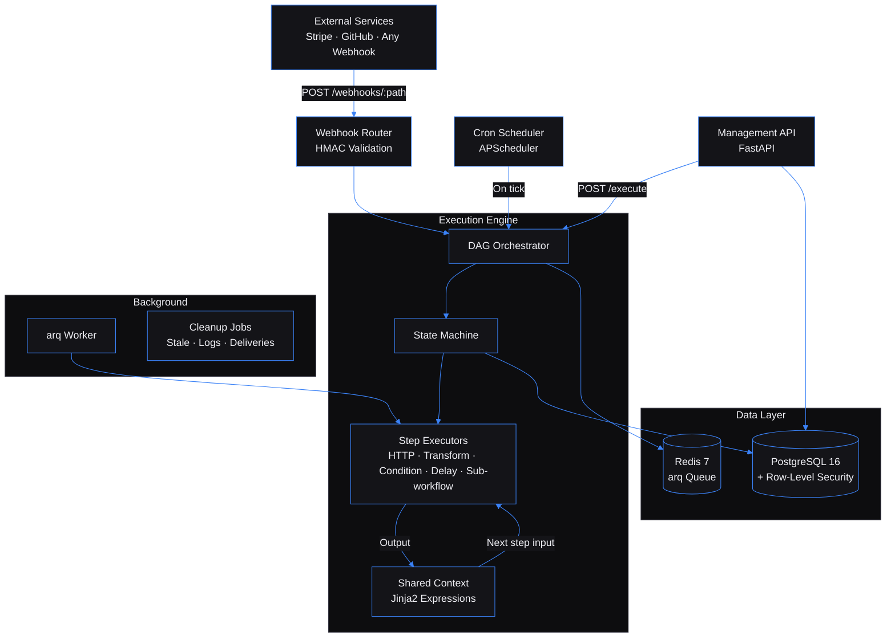

# Workflow Automation Engine — A self-hosted backend for executing multi-step workflows as directed acyclic graphs

Built by [Kingsley Onoh](https://kingsleyonoh.com) · Systems Architect

> **Live:** [https://workflows.kingsleyonoh.com](https://workflows.kingsleyonoh.com)

## The Problem

Every backend eventually needs to chain multiple operations: receive a webhook, call an external API, branch on the result, send a notification, and retry if something fails. Most teams either hard-code these pipelines into their application (making them impossible to change without a deploy) or pay per-task pricing to services like Zapier. This engine handles that orchestration layer — you define workflows as DAGs via API, and the engine executes them with state persistence, retry logic, conditional branching, and real-time status streaming. Multi-tenant from day one, so one instance serves many projects with full data isolation.

## Architecture



## Key Decisions

- **I chose FastAPI + async SQLAlchemy over Django** because every operation in a workflow engine is I/O-bound — waiting on external HTTP calls, database writes, Redis queue operations. Full async from route handler to database driver means one Python process handles many concurrent executions without blocking.

- **I chose PostgreSQL Row-Level Security over application-only tenant filtering** because a missed `WHERE tenant_id = ...` in one query leaks data across tenants. RLS enforces isolation at the database layer — even a bug in the application code can't read another tenant's rows.

- **I chose inline DAG execution over pure arq dispatch** because dispatching every step as a queue job adds ~50ms latency per step and complicates state management. The orchestrator runs steps directly in the async context, with arq available for background jobs and future horizontal scaling.

- **I chose Jinja2 SandboxedEnvironment over a custom expression language** because Jinja2 is well-tested, widely understood, and the sandbox prevents server-side template injection. Users write `{{ steps.fetch.output.body.name }}` — familiar syntax, zero security risk from untrusted expressions.

## Setup

### Prerequisites

- Python 3.12+
- PostgreSQL 16
- Redis 7
- Docker + Docker Compose (for local services)

### Installation

```bash
git clone https://github.com/kingsleyonoh/Workflow-Automation-Engine.git
cd Workflow-Automation-Engine
python -m venv venv
source venv/bin/activate  # Windows: .\venv\Scripts\activate
pip install -e .
```

### Environment

```bash
cp .env.example .env
```

| Variable | Required | Default | Description |
|----------|----------|---------|-------------|
| `DATABASE_URL` | Yes | — | PostgreSQL connection (asyncpg driver) |
| `REDIS_URL` | Yes | — | Redis connection for arq queue |
| `ENV` | No | `development` | `development` / `production` / `testing` |
| `PORT` | No | `8000` | Server port |
| `SELF_REGISTRATION_ENABLED` | No | `true` | Allow public tenant registration |
| `MAX_STEPS_PER_WORKFLOW` | No | `50` | Max steps in a workflow DAG |
| `EXECUTION_TIMEOUT_SECONDS` | No | `300` | Max execution duration |
| `HTTP_STEP_TIMEOUT` | No | `30` | Timeout for HTTP step calls |
| `MAX_SUB_WORKFLOW_DEPTH` | No | `3` | Max nested sub-workflow depth |
| `WEBHOOK_REPLAY_ENABLED` | No | `true` | Allow execution replay |
| `CRON_TIMEZONE` | No | `UTC` | Timezone for cron triggers |
| `ARQ_CONCURRENCY` | No | `10` | Background worker concurrency |

### Run

```bash
# Start PostgreSQL + Redis
docker compose up -d

# Run migrations
alembic upgrade head

# Seed default tenant + sample workflows
python -m src.tenants.seed

# Start the API server
uvicorn src.main:app --reload

# Start the background worker (separate terminal)
arq src.queue.worker.WorkerSettings
```

## How It Works

```
1. TRIGGER        2. PARSE DAG       3. EXECUTE STEPS         4. RESULT
                                         ┌─[http]─┐
webhook ──→  resolve step   ──→  [transform] ──→ [condition] ──→  execution
  or          order from           │         ├─[true]──→ [notify]  complete
cron tick     depends_on           │         └─[false]─→ [skip]
  or                               │
manual API                    each step output merges
                              into shared context for
                              downstream steps
```

Every state transition is persisted to PostgreSQL before execution proceeds. If the server crashes, pending executions can be identified and recovered from the last persisted state.

## Usage

### Quick Integration (5 lines)

Any project can trigger workflows with a single HTTP call:

```python
import httpx

async def run_workflow(workflow_id: str, data: dict) -> str:
    r = await httpx.AsyncClient().post(
        f"https://workflows.kingsleyonoh.com/api/workflows/{workflow_id}/execute",
        headers={"X-API-Key": "YOUR_KEY", "Content-Type": "application/json"},
        json={"trigger_data": data},
    )
    return r.json()["execution_id"]
```

### Register a Tenant

```bash
curl -X POST https://workflows.kingsleyonoh.com/api/tenants/register \
  -H "Content-Type: application/json" \
  -d '{"name": "My Project"}'
```

Returns a one-time API key (`wae_live_...`). Save it — it's never shown again.

### Create a Workflow

```bash
curl -X POST https://workflows.kingsleyonoh.com/api/workflows \
  -H "X-API-Key: YOUR_KEY" \
  -H "Content-Type: application/json" \
  -d '{
    "name": "Order Pipeline",
    "trigger_type": "webhook",
    "webhook_secret": "my-secret",
    "steps": [
      {"id": "validate", "type": "transform",
       "config": {"expression": "Order #{{ trigger.payload.order_id }} for {{ trigger.payload.customer }}"},
       "depends_on": []},
      {"id": "check_amount", "type": "condition",
       "config": {"expression": "{{ trigger.payload.amount > 100 }}",
                  "true_branch": ["high_value"], "false_branch": ["standard"]},
       "depends_on": ["validate"]},
      {"id": "high_value", "type": "transform",
       "config": {"expression": "Escalate: ${{ trigger.payload.amount }}"},
       "depends_on": ["check_amount"]},
      {"id": "standard", "type": "transform",
       "config": {"expression": "Auto-approve: ${{ trigger.payload.amount }}"},
       "depends_on": ["check_amount"]}
    ]
  }'
```

### Fire a Webhook

```bash
PAYLOAD='{"order_id":"ORD-001","customer":"Jane","amount":250}'
SECRET="my-secret"
SIG=$(echo -n "$PAYLOAD" | openssl dgst -sha256 -hmac "$SECRET" | awk '{print $2}')

curl -X POST https://workflows.kingsleyonoh.com/webhooks/wh_YOUR_PATH \
  -H "Content-Type: application/json" \
  -H "X-Hub-Signature-256: sha256=$SIG" \
  -d "$PAYLOAD"
```

Returns `202 Accepted` with `{"execution_id": "..."}`.

### Check Results

```bash
curl https://workflows.kingsleyonoh.com/api/executions/EXEC_ID \
  -H "X-API-Key: YOUR_KEY"
```

Returns the execution status plus every step's result — which branch was taken, what each transform produced, what each HTTP call returned.

### What It Handles

| Capability | Detail |
|-----------|--------|
| DAG execution | Steps run in dependency order, parallel where possible |
| Condition branching | True/false paths with automatic skip of non-taken branch |
| HTTP calls | External API calls with retry on 5xx, configurable timeout |
| Data transforms | Jinja2 expressions with access to all previous step outputs |
| Delays | Pause execution for N seconds between steps |
| Sub-workflows | Nest entire workflows, up to 3 levels deep |
| Cron scheduling | Standard 5-field cron expressions via APScheduler |
| HMAC validation | SHA-256 signature verification on webhook payloads |
| Execution replay | Re-run any execution with the original or overridden trigger data |
| SSE streaming | Real-time step status updates via Server-Sent Events |
| Multi-tenant | API key auth, every query scoped by tenant_id, PostgreSQL RLS |
| Metrics | Execution counts, durations, step failure rates, webhook stats |

### API Reference

| Method | Path | Auth | Purpose |
|--------|------|------|---------|
| POST | `/api/tenants/register` | None | Register tenant, get API key |
| GET | `/api/tenants/me` | Key | Tenant profile |
| POST | `/api/workflows` | Key | Create workflow |
| GET | `/api/workflows` | Key | List workflows (paginated) |
| GET | `/api/workflows/:id` | Key | Get workflow |
| PUT | `/api/workflows/:id` | Key | Update workflow |
| DELETE | `/api/workflows/:id` | Key | Delete workflow |
| POST | `/api/workflows/:id/execute` | Key | Manual trigger |
| POST | `/webhooks/:path` | HMAC | Webhook trigger |
| GET | `/api/executions` | Key | List executions (filtered) |
| GET | `/api/executions/:id` | Key | Execution detail + steps |
| POST | `/api/executions/:id/cancel` | Key | Cancel execution |
| POST | `/api/executions/:id/replay` | Key | Replay execution |
| GET | `/api/executions/:id/logs` | Key | Execution logs |
| GET | `/api/executions/:id/stream` | Key | SSE step updates |
| GET | `/api/metrics/executions` | Key | Analytics dashboard |
| GET | `/api/health` | None | System health |

## Tests

```bash
# Unit + integration (544 tests)
python -m pytest

# E2E (against running server)
python -m pytest tests/e2e/ -m e2e

# Load test (50 concurrent executions)
python -m pytest tests/load/ -m load
```

## AI Integration

This project includes machine-readable context for AI tools:

| File | What it does |
|------|-------------|
| [`llms.txt`](llms.txt) | Project summary for LLMs ([llmstxt.org](https://llmstxt.org)) |
| [`openapi.yaml`](openapi.yaml) | OpenAPI 3.1 API specification |
| [`mcp.json`](mcp.json) | MCP server definition for AI IDEs |

### Cursor / Other AI IDEs
Point your AI agent at `AGENTS.md` for full codebase context.

## Deployment

This project runs on a DigitalOcean VPS behind Traefik with automatic image pulls via Watchtower.

### Production Stack

| Component | Role |
|-----------|------|
| `workflow-engine` | FastAPI app server (Traefik-routed, HTTPS) |
| `workflow-engine-worker` | arq background worker (step execution, cron jobs) |
| PostgreSQL 16 | Workflow state, execution history, tenant data |
| Redis 7 | arq job queue, SSE pub/sub, rate limiting |

### Self-Host

```bash
# Pull the image
docker pull ghcr.io/kingsleyonoh/workflow-engine:latest

# Or use the compose file
docker compose -f docker-compose.prod.yml up -d

# Run migrations
docker exec workflow-engine alembic upgrade head

# Seed default tenant
docker exec workflow-engine python -m src.tenants.seed
```

Set the environment variables listed in **Setup > Environment** before starting.

<!-- THEATRE_LINK -->
